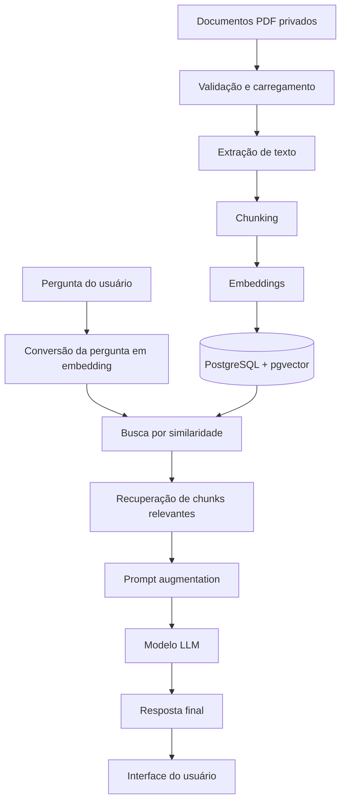
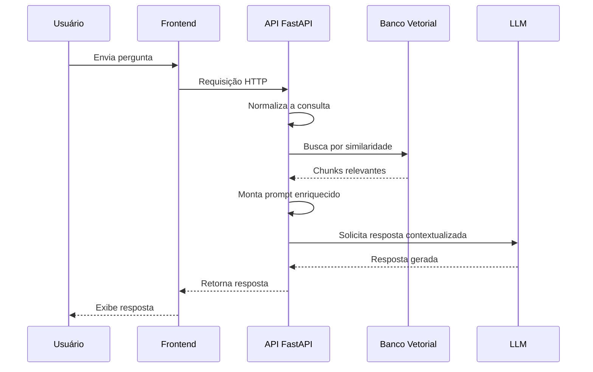

# Documentação de Arquitetura: Chatbot Enterprise Baseado em RAG

## 1. Visão Geral

Este projeto tem como objetivo propor e documentar a arquitetura de um chatbot enterprise baseado em Retrieval-Augmented Generation (RAG), voltado para responder dúvidas com base em documentos PDF privados. A solução foi concebida para operar em ambientes corporativos, com foco em precisão, rastreabilidade, governança de dados e uso de tecnologias de baixo custo, priorizando ferramentas open-source ou com planos gratuitos.

O sistema será responsável por receber perguntas em linguagem natural, localizar trechos relevantes em uma base documental privada, fornecer contexto ao modelo de linguagem e devolver uma resposta fundamentada, com maior aderência às fontes internas da organização.

A arquitetura propõe um pipeline composto por ingestão documental, processamento por chunks, geração de embeddings, consulta vetorial, enriquecimento do prompt e resposta final por um modelo LLM, tudo de forma controlada e alinhada às exigências de segurança e privacidade de dados corporativos.

---

## 2. Objetivo do Sistema

O objetivo principal do chatbot enterprise é permitir acesso eficiente e seguro ao conhecimento institucional contido em materiais PDF privados, sem depender de respostas genéricas baseadas em conhecimento público. A solução deve:

- responder dúvidas com base em documentos corporativos;
- manter o contexto documental relevante e verificável;
- reduzir a probabilidade de alucinação do modelo;
- permitir escalabilidade para grandes volumes de documentos;
- operar com custos mínimos, utilizando recursos gratuitos ou open-source.

---

## 3. Escopo da Arquitetura

### 3.1 Tipo de sistema

O sistema classifica-se como um chatbot RAG, isto é, um sistema que combina:

- recuperação de informações relevantes em uma base documental;
- geração de resposta por um modelo de linguagem;
- uso de contexto extraído do corpus documental como suporte à resposta final.

### 3.2 Contexto de uso

A solução foi pensada para uso interno de organizações, com documentos armazenados em PDF privados, tais como:

- políticas internas;
- manuais operacionais;
- contratos e regulamentos;
- relatórios e procedimentos;
- documentos de suporte técnico e comercial.

### 3.3 Stack arquitetural sugerida

- Backend/API: FastAPI (Python)
- Banco de Dados: PostgreSQL com extensão pgvector
- Modelo LLM: Groq API (Llama 3) ou Google Gemini API
- Embeddings: Nomic Embed Text ou Hugging Face
- Frontend: Streamlit ou Next.js + Tailwind CSS
- Custos: zero, utilizando versões livres ou planos gratuitos

---

## 4. Requisitos de Sistema

### 4.1 Requisitos funcionais

1. Upload e ingestão de documentos PDF privados.
2. Extração do conteúdo textual dos documentos.
3. Segmentação do texto em chunks ou blocos semânticos.
4. Geração de representações vetoriais para cada chunk.
5. Armazenamento das embeddings em banco vetorial.
6. Recebimento de pergunta em linguagem natural.
7. Busca por similaridade entre a pergunta e os chunks indexados.
8. Montagem de prompt enriquecido com contexto relevante.
9. Geração de resposta por modelo LLM.
10. Apresentação da resposta ao usuário em interface web ou streamlit.
11. Tratamento de cenários sem contexto suficiente.
12. Registro de metadados do processo de consulta e resposta.

### 4.2 Requisitos não funcionais

- Disponibilidade: alta disponibilidade para uso interno empresarial.
- Escalabilidade: capacidade de ampliar base documental e volume de consultas.
- Segurança: isolamento dos documentos privados e proteção de dados sensíveis.
- Integridade: manutenção de referências entre documentos, chunks e embeddings.
- Performance: tempos de resposta adequados para interações humanas.
- Confiabilidade: mecanismos para lidar com falhas de busca, ausência de contexto e indisponibilidade do provedor LLM.
- Manutenibilidade: separação clara entre camada de ingestão, recuperação e geração.
- Observabilidade: rastreabilidade de consultas e respostas para auditoria.

### 4.3 Requisitos de qualidade

- precisão de recuperação;
- validade do contexto recuperado;
- minimização de respostas sem suporte documental;
- clareza da resposta final;
- rastreio de origem documental da resposta.

---

## 5. Arquitetura Geral do Sistema

A arquitetura segue um modelo modular, em que cada componente é responsável por uma etapa específica do ciclo RAG. O fluxo básico é descrito a seguir:

1. O usuário envia uma pergunta pela interface.
2. O backend recebe a requisição.
3. O sistema consulta a base vetorial por similaridade.
4. O conteúdo recuperado é incorporado ao prompt.
5. O LLM gera uma resposta usando o contexto documental.
6. A resposta é devolvida ao usuário, com possibilidade de citar a origem documental.

A partir dessa estrutura, há também a etapa de ingestão documental, que transforma os PDFs em chunks, gera embeddings e salva os vetores em banco de dados otimizado para busca semântica.

---

## 6. Componentes Arquiteturais

### 6.1 Camada de apresentação

Responsável pela interface entre usuário e sistema. Pode ser implementada em:

- Streamlit, quando se busca simplicidade e rapidez de prototipagem;
- Next.js + Tailwind CSS, quando se busca uma interface mais robusta, moderna e escalável para ambiente enterprise.

### 6.2 Camada de API e orquestração

A camada de backend será implementada em FastAPI. Essa escolha é fundamentada na sua capacidade de:

- expor endpoints REST para consultas e gestão documental;
- estruturar fluxos assíncronos e modularizados;
- atender aplicações de IA com alta produtividade e boa documentação;
- integrar facilmente com serviços externos de embeddings e LLM.

### 6.3 Camada de persistência

O PostgreSQL será adotado como base relacional principal, com extensão pgvector para suportar operações vetoriais. Essa combinação permite:

- armazenamento relacional de metadados, usuários, documentos, sessões e histórico;
- armazenamento de embeddings em uma estrutura adequada para busca por similaridade;
- manutenção da integridade de dados e suporte a consultas híbridas.

### 6.4 Camada de processamento documental

Essa camada realiza a ingestão de documentos PDF, extração textual, chunking, geração de embeddings e organização dos dados para recuperação.

### 6.5 Camada de busca semântica

A busca semântica é responsável por comparar a pergunta do usuário com os chunks indexados. O mecanismo de similaridade deve ser capaz de recuperar trechos relevantes para compor o contexto do modelo.

### 6.6 Camada de geração de resposta

A geração da resposta é feita por um modelo LLM, preferencialmente Groq API com Llama 3 ou Google Gemini API, em função dos modelos gratuitos ou de baixo custo disponíveis. O LLM não deve responder com base apenas em seu conhecimento prévio; ele deve operar sobre um contexto recuperado e explicitamente informado pelo sistema.

---

## 7. Fluxo do Processo RAG

### 7.1 Ingestão de dados

O processo começa com a inserção de arquivos PDF privados no sistema. Os documentos passam por validação, organização e classificação por domínio ou unidade corporativa.

### 7.2 Extração e pré-processamento

A etapa de extração textual remove o conteúdo legível dos PDFs e normaliza as informações para processamento posterior. Esse estágio inclui:

- limpeza de ruído;
- eliminação de elementos não textuais;
- padronização de caracteres e pontuação;
- identificação da estrutura documental.

### 7.3 Chunking

Os documentos são divididos em blocos de texto, conhecidos como chunks. Essa divisão é essencial porque:

- melhora a recuperação semântica;
- reduz a perda de contexto em documentos longos;
- aumenta a precisão da busca vetorial;
- facilita a associação entre trecho recuperado e documento de origem.

### 7.4 Geração de embeddings

Cada chunk é convertido em um vetor numérico por um modelo de embeddings. Essa representação permite comparar a semântica da pergunta com o conteúdo documental armazenado.

### 7.5 Indexação e armazenamento

Os embeddings e os metadados relacionados são armazenados no PostgreSQL com pgvector. A indexação facilita a consulta por similaridade em tempo reduzido.

### 7.6 Consulta do usuário

Quando o usuário faz uma pergunta, a aplicação:

- converte a pergunta em embedding;
- compara esse vetor com os vetores armazenados;
- recupera os chunks mais similares;
- ordena os resultados por relevância.

### 7.7 Prompt augmentation

Os chunks selecionados são incorporados ao prompt do modelo LLM. Essa etapa é central para o RAG, porque o modelo recebe contexto documental específico antes de responder.

### 7.8 Resposta final

O modelo produz uma resposta com base no contexto recuperado, e a aplicação pode complementar a resposta com:

- origem documental;
- citação de trechos relevantes;
- indicação de grau de confiança ou ausência de contexto.

---

## 8. Casos de Uso (UML)

### 8.1 Atores

- Usuário final: realiza consultas em linguagem natural.
- Administrador: gerencia documentos, permissões e monitoramento.
- Sistema documental: fornece os artefatos PDF e metadados para processamento.
- Modelo LLM: gera respostas a partir do contexto recuperado.

### 8.2 Casos de uso centrais

- Realizar pergunta ao chatbot;
- Ingerir documentos PDF;
- Gerar embeddings;
- Consultar base vetorial;
- Recuperar contexto relevante;
- Gerar resposta com suporte documental;
- Tratar ausência de contexto ou falha na recuperação.

### 8.3 Diagrama de casos de uso em Mermaid

```mermaid
usecaseDiagram
    actor "Usuário" as User
    actor "Administrador" as Admin
    actor "Modelo LLM" as LLM
    actor "Sistema documental" as Docs

    rectangle "Chatbot Enterprise RAG" {
        usecase "Enviar pergunta" as UC01
        usecase "Ingerir documento PDF" as UC02
        usecase "Gerar embeddings" as UC03
        usecase "Consultar base vetorial" as UC04
        usecase "Recuperar contexto" as UC05
        usecase "Gerar resposta" as UC06
        usecase "Tratar ausência de contexto" as UC07
    }

    User --> UC01
    Admin --> UC02
    Docs --> UC02
    UC02 ..> UC03 : <<include>>
    UC01 ..> UC04 : <<include>>
    UC04 ..> UC05 : <<include>>
    UC05 ..> UC06 : <<include>>
    UC01 ..> UC07 : <<extend>>
    LLM --> UC06
```

### 8.4 Relacionamentos semânticos

- <<include>>: a execução de um caso de uso central depende da execução de outra etapa obrigatória, como geração de embedding, busca vetorial e chamada ao LLM.
- <<extend>>: o tratamento de falha ou ausência de contexto amplia o comportamento principal, oferecendo resposta mais segura ao usuário.

---

## 9. Fluxo Arquitetural em Diagrama



Este diagrama mostra a separação entre a fase de ingestão e a fase de consulta, representando os dois pilares do modelo RAG: indexação e recuperação.

---

## 10. Sequência de Interação do Sistema



---

## 11. Matriz Tecnológica e Justificativa Acadêmica

| Componente                   | Tecnologia                         | Justificativa acadêmica e técnica                                                                                                       |
| ---------------------------- | ---------------------------------- | --------------------------------------------------------------------------------------------------------------------------------------- |
| Backend/API                  | FastAPI                            | Framework leve, assíncrono, com alta produtividade em Python, documentação clara e excelente integração com serviços de IA e APIs REST. |
| Banco de dados relacional    | PostgreSQL                         | Excelente estabilidade, maturidade, suporte transacional e integração com arquitetura enterprise.                                       |
| Banco vetorial               | pgvector                           | Extensão adequada para armazenar embeddings e executar buscas de similaridade em conjunto com dados relacionais.                        |
| Modelo de linguagem          | Groq API / Google Gemini API       | Oferecem acesso a modelos de alto desempenho com custo reduzido ou gratuito, adequados para ambientes acadêmicos e prototipagem.        |
| Embeddings                   | Nomic Embed Text / Hugging Face    | Soluções abertas e acessíveis para transformar texto em representações semânticas, com boa aderência a tarefas de recuperação.          |
| Frontend                     | Streamlit / Next.js + Tailwind     | Streamlit é ideal para protótipos e dashboards, enquanto Next.js oferece interface mais robusta e profissional para uso enterprise.     |
| Arquitetura de processamento | RAG                                | Combina recuperação de contexto documental com geração linguística, reduzindo alucinações e aumentando a aderência às fontes internas.  |
| Persistência documental      | PostgreSQL + metadados documentais | Permite organização rigorosa de documentos, versões, chaves, histórico e rastreabilidade.                                               |
| Busca semântica              | Similaridade vetorial              | Estratégia essencial para encontrar informações semânticas em grandes coleções textuais, mais eficaz que busca literal.                 |

### 11.1 Análise comparativa de alternativas

| Opção                 | Vantagens                                   | Desvantagens                                                     | Avaliação                 |
| --------------------- | ------------------------------------------- | ---------------------------------------------------------------- | ------------------------- |
| FastAPI               | Simplicidade, desempenho, integração com IA | Requer organização correta de endpoints e serviços               | Forte escolha             |
| Flask                 | Leve, mas menos estruturado                 | Menor escalabilidade de arquitetura moderna                      | Secundária                |
| PostgreSQL + pgvector | Flexibilidade e qualidade de busca híbrida  | Requer configuração adequada de índices                          | Melhor escolha            |
| MongoDB + vetorização | Flexibilidade documental                    | Menos alinhado com estrutura relacional e metadados corporativos | Menos adequado            |
| Groq / Gemini         | Baixo custo, bom desempenho                 | Dependência de provedores externos                               | Adequado ao escopo        |
| LLM local             | Privacidade maior                           | Maior demanda computacional e suporte técnico                    | Estratégia futura         |
| Streamlit             | Rápido para prototipagem                    | Menor customização em UX enterprise                              | Boa opção inicial         |
| Next.js + Tailwind    | Expansibilidade e design profissional       | Maior complexidade de desenvolvimento                            | Melhor para produto final |

---

## 12. Requisitos de Segurança e Governança

A solução deve respeitar princípios de governança de dados e segurança da informação:

- controle de acesso aos documentos privados;
- autenticação de usuários e papéis administrativos;
- segregação por domínio, área ou grupo organizacional;
- não exposição de dados sensíveis no prompt de forma indiscriminada;
- rastreabilidade das fontes consultadas;
- logs de consulta, resposta e documentação de origem.

No contexto enterprise, a confiabilidade do chatbot depende não apenas da qualidade da resposta, mas também da capacidade de demonstrar de onde a informação foi extraída.

---

## 13. Estratégia de Tratamento de Falhas

A arquitetura deve contemplar cenários adversos, incluindo:

- ausência de contexto relevante;
- documento incompleto ou corrompido;
- erro na geração do embedding;
- indisponibilidade do provedor LLM;
- alta latência de resposta;
- consultas ambíguas ou vagas.

Em casos de ausência de contexto, o sistema deve responder de forma honesta, indicando que a informação não foi encontrada nos documentos indexados. Esse comportamento é essencial para reduzir alucinações e aumentar a confiabilidade do sistema.

---

## 14. Considerações de Escalabilidade

O sistema deve ser dimensionado para crescer em três dimensões:

1. volume de documentos;
2. número de usuários simultâneos;
3. complexidade de consultas.

Para isso, a arquitetura deve prever:

- particionamento ou organização por áreas funcionais;
- indexação vetorial eficiente;
- cache de consultas frequentes;
- separação clara entre ingestão e consulta;
- monitoramento de latência e qualidade de recuperação.

---

## 15. Benefícios da Arquitetura Proposta

A arquitetura RAG proposta oferece uma combinação estratégica de eficiência e confiabilidade:

- respostas mais precisas e contextualizadas;
- uso de conhecimento privado da organização;
- redução de dependência de conhecimento genérico do modelo;
- maior transparência e rastreabilidade documental;
- viabilidade prática com custo zero ou muito baixo;
- alinhamento com princípios de sistemas enterprise e IA explicável.

---

## 16. Conclusão

A arquitetura proposta para o chatbot enterprise baseado em RAG representa uma solução adequada para ambientes corporativos que precisam consultar documentos privados com precisão, segurança e eficiência. A combinação entre FastAPI, PostgreSQL com pgvector, modelos LLM gratuitos ou de baixo custo e busca semântica por embeddings oferece uma base tecnológica sólida, com alto potencial acadêmico e prático.

O diferencial do projeto não está apenas na geração de uma resposta natural, mas na capacidade do sistema de fundamentar cada resposta em fontes internas verificáveis. Nesse sentido, a arquitetura RAG torna-se uma alternativa estratégica para organizações que buscam modernizar o acesso ao conhecimento institucional sem comprometer confiabilidade, escalabilidade e custo.

---

## 17. Referências Conceituais

- Lewis, P., et al. (2020). Retrieval-Augmented Generation for Knowledge-Intensive NLP Tasks.
- OpenAI / Anthropic / Google / Groq documentation on LLM usage and API integration.
- PostgreSQL official documentation on pgvector extension.
- Research on embeddings and semantic search in document retrieval systems.
- Architecture patterns for enterprise AI systems and data governance.

---

## 18. Resumo Executivo

O projeto consiste em um chatbot enterprise RAG para documentos privados em PDF, com arquitetura composta por:

- interface acessível para usuários;
- API em FastAPI;
- banco relacional e vetorial em PostgreSQL + pgvector;
- geração de embeddings por modelos gratuitos;
- busca semântica para recuperação de contexto;
- resposta final via Groq/Gemini;
- tratamento formal de ausência de contexto e falhas.

Essa combinação resulta em uma solução técnicamente viável, academicamente relevante e alinhada aos objetivos de pesquisa em IA aplicada, arquitetura de software e engenharia de requisitos.
